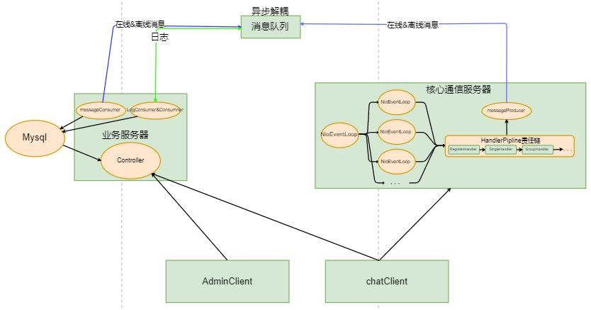

# Netty高性能聊天室

### 简要介绍
高性能聊天室项目，主要由用户客户端，管理客户端，通信服务器，业务服务器构成。
其高性能主要体现在
- 高并发:通信端基于Netty架构，NIO多路复用与分组线程池实现多线程下的可靠性
- 高速度:通信端与业务端解耦，由RocketMQ通信与异步解耦；将通信服务器大量耗时的在线消息储存，离线消息储存和业务端的大量日志储存通过消息队列中转，使通信端减少阻塞，提高消息响应时间，增加系统整体的可靠性。
- 高可用:多模块开发，通信服务器不依赖于其他模块，其需要的所有信息由前端拉取业务服务器后发送。可支持多机部署(暂未实现)。

### 架构图


### 主要技术栈
- 前端
    - vue相关技术栈
        - vue-cli
        - vuex
        - vue-router
    - element-UI
    - axios
    - 管理客户端基于开源项目 vue-admin-templete
- 后端
    - maven多模块开发
    - springboot
    - RocketMQ
    - Netty
    - mybatis
    - mysql

### 运行方法
- 前端：
    - 更改请求地址
    - npm install
    - npm run serve(客户端)
    - npm run dev(管理端)
- 后端:
    - 部署数据库(在relate_notes下)
    - 部署rocketMQ
    - 更改两者配置
    - 运行admin-serve模块(业务服务器)和serve模块(通信服务器)

### 问题记录
- ```java
  ch.pipeline().addLast(HttpRequestHandler.INSTANCE);
  ch.pipeline().addLast(RegisterRequestHandler.INSTANCE);
  ch.pipeline().addLast(MessageRequestHandler.INSTANCE);
  ch.pipeline().addLast(CreateGroupRequestHandler.INSTANCE);
  ch.pipeline().addLast(GroupMessageRequestHandler.INSTANCE);
  ch.pipeline().addLast(HeartBeatRequestHandler.INSTANCE);
  ch.pipeline().addLast(ExceptionHandler.INSTANCE);
  ```
  - ```HttpRequestHandler```
  关于使用那个handler，通过前端传回控制字符控制，在第一个处理器(HttpHandler)中获取并添加到传输的包中
  - ```RegisterRequestHandler```
  从chanel中获取用户信息并注册到本地用户池？？？前置处理

- Websocket前后端传输的协议解析
  ```type```:
  ```prama```

- handler责任链模式 **设计模式**
  handler传入的参数类型必须与继承的父类传入的泛型一致，否则不会被执行；可以借此来选择handler


- 关于netty处理器继承的```SimpleChannelInboundHandler<T>``` 关于其传入的泛型

- json字符串与json对象的转换（前端）
  https://www.cnblogs.com/chengxs/p/8289890.html
  https://www.cnblogs.com/chengxs/p/8656723.html
- json字符串与json对象的转换（后端）
  见Mysocket类

- @Sharable不是线程安全的，多个channel共享一个handler实例

- TextWebSocketFrame 分多帧传输，在责任链第一条链分流 **这里运用了什么设计模式？**

- 前后端交互的方式
  - ```js
  socket.send(JSON.stringify(data));
  ```
  将json对象转变为json字符串以传输 后端将json字符串转变为json对象，再转变为bean
  ```
  //                将json对象转换为实体类
                User user =  JSON.parseObject(parmas.toJSONString(), User.class);
                registerRequestPacket.setUser(user);
  ```
- 如果直接用ajax/axios传后端用@responsebody接收自动转换
  > 和上一中方式的联系？是不是一样的？hander中的content-type参数

- 前后端鉴权和token暂未添加

- 消息队列的问题，传岑问题暂未解决

- 跨域问题
  - 后端使用@CrossOrigin注解
  - 前端使用注意添加http/https

- 使用element-UI
  - vue文件中可以使用全局引用的方式(毕竟是在vue的入口文件中引用的...)
  - js文件中需要额外import
  - main.js为vue架构的入口文件，app.vue为跟组件，在界面开始运行时挂载在index.html上

- 清楚前端的默认样式:在入口文件中引入类似于reset.css的样式清楚文件

- 数据改错 resultMap的column要和数据库的字段名对应上

- 通信服务器端和客户端使用json编码传输，前端传输时先转成json字符串，后端收到后转成jsonObject，再转为对应的实体类。后端先用用jsonObject封装，再转成字符，最后```byteBuf.writeBytes```封装，传回channel
> 要是不用json字符串做中转怎么办

- netty globle异常，情况很多
  - 如netty中packet参数不对应，也会报此异常
  -  vuex中的state会在某一个组建中使用，而这个状态的初始化是通过异步加载完成的。组件在渲染过程中，获取的state状态为空。也就是说组件在异步完成之前
  - 就已经完成渲染了，导致组件的数据没有来得及渲染。(**私聊对象的刷新**)

- 消息队列中储存的默认转为json字符串，consumer中需要把json字符串转为实体类
  - json字符串和json对象的区别在于前者的key有双引号，后者的key没有双引号

- js中数组添加元素，新元素会覆盖旧元素的问题
  - 问题复现
  ```js
  data(){
    response:{},
    resList:[]
  }
  change(){
      this.response.id = this.response.id++
      this.response.state = 0
      this.response.message = info.message
      this.response.userName = this.selfInfo.userName
      this.response.date = info.date
      
      console.log("这里是私聊回复处理类：")
      console.log(this.resList)
     
      this.resList.push(response)
  }
  ```
  每次添加之后resList中的所有数组元素都是最后一个
  - ***原因**
  每次取出来的值都放在this.response中，因为是在外面的定义的对象，所以每次的地址是一样的，this.resList中保存的是this.response的地址，当最后一次给this.response赋值为789时，由于是同一个地址,所有所有元素的值只是变量名不一样，指针指向的地址一样了

- 前端群聊创建与群聊逻辑处理，体会后端模块解耦与前后端分离的好处，处处解耦，各信息单独拉取，分别储存，实际简化了逻辑处理

- 在在线群组消息创建中，当群组中有人没上线时，后上线的人创建的群组(ChannelGroup)会覆盖之前的，此时需要传回新的通信端groupid在前端存储。此时服务端之前的ChannelGroup无人使用，浪费空间。有什么解决方法？

- 前端创建群组逻辑(*vuex中存储消息类型没有规划好，有些混乱*)
  - 在```list.vue```组件中选择消息群组，vuex当前消息对象状态码更新为9(**此处储存的是业务端的groupid**)
  - ```chatroom.vue```组件中监听vuex消息对象状态变化，判断是否状态码为9
  - 若为9，则发送创新群组类型的消息，且在creatGroup函数中置状态码为 3，与后端沟通(send中状态再判断)
  - 若创建成功，返回状态码为 4
  - 若返回状态码为 4 或 **其他新用户上线更新后端groupchannel，也会向所有的在线用户发送一个4状态码的消息**，则更新```chatroom.vue```组件中的groupId(**此处储存的是通信端的groupid**)状态，更新为后端回传的最新的(当有新用户上线时，后端会启用新的groupchannel，此时之前的groupid放弃用)
  - 接下来的每次群聊消息发送，都使用的是```chatroom.vue```下的groupid，而type为9，与vuex中的相同，不需要判断与改变

- 找bug，netty的handler责任链中只有全局异常处理，当报全局异常错误时可能有多种错误情况，此时建议断点调试

- 群聊消息如果有人不在，离校消息如何处理暂时未处理。

> TextWebSocketFrame是什么，
> 和普通的string有什么区别，
> 和json之间如何转换，
> 可否将如websockethandler中的编码解码操作抽离